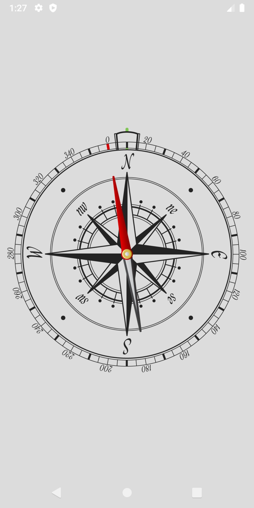
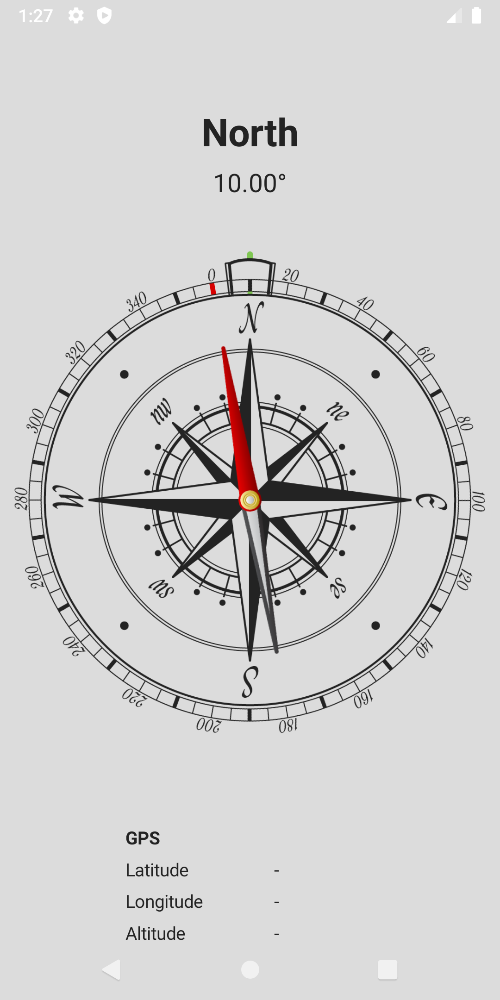
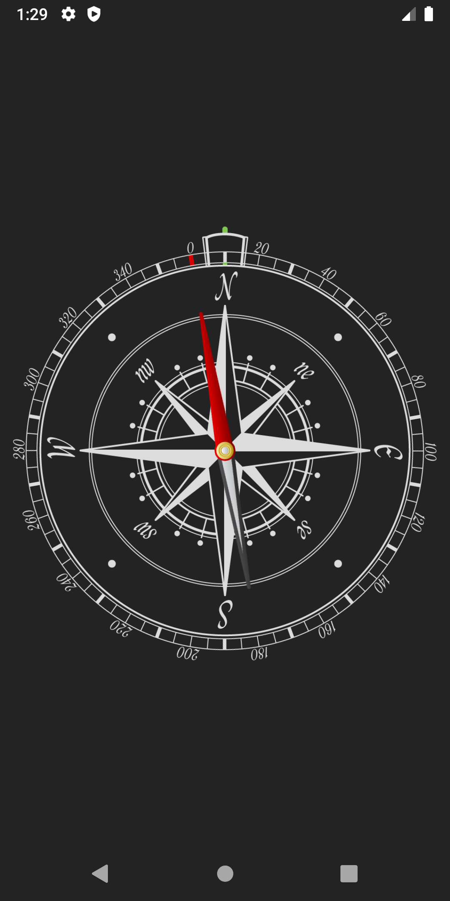
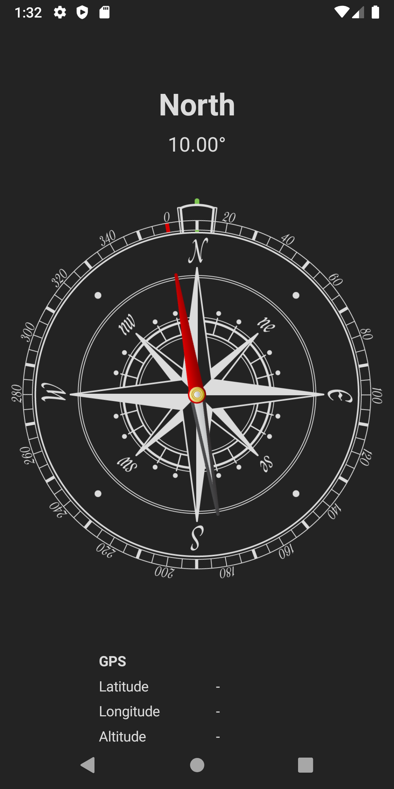

# Android Compass
This is a compass app made for Android devices built using Microsoft's Xamarin C# framework. The application acts like a real compass would in real life, using the device's magnetometer to sense the earth's magnetic field. The app responds to the tap gestures and the device theme. For enhanced visual fidelity, the app uses the device's gyroscope to keep the compass face level with the ground, regardless of device orientation. By default the application shows just a compass face, however there is also a detailed mode which shows bearing, gps coordinates and altitude above sea level.

 
 

## Code
### Compass View Model
```C#
using System;
using System.Collections.Generic;
using System.Text;
using System.ComponentModel;
using Xamarin.Forms;
using Xamarin.Essentials;
using System.Numerics;

namespace Compass.ViewModels
{
    public class CompassViewModel : INotifyPropertyChanged
    {
        public double Heading { get => heading; set { heading = value; PropertyChanged?.Invoke(this, new PropertyChangedEventArgs(nameof(Heading))); } }
        public string HeadingString { get => headingString; set { headingString = value; PropertyChanged?.Invoke(this, new PropertyChangedEventArgs(nameof(HeadingString))); } }
        public double InverseHeading { get => inverseHeading; set { inverseHeading = value; PropertyChanged.Invoke(this, new PropertyChangedEventArgs(nameof(InverseHeading))); } }
        public double BearingRotation { get => bearingRotation; set { bearingRotation = value; PropertyChanged.Invoke(this, new PropertyChangedEventArgs(nameof(BearingRotation))); } }
        public string DirectionString {
            get
            {
                return directionString;
            }
            set 
            { 
                directionString = value; 
                PropertyChanged?.Invoke(this, new PropertyChangedEventArgs(nameof(DirectionString))); 
            }
        }
        public double Pitch { get => pitch; private set { pitch = value; PropertyChanged?.Invoke(this, new PropertyChangedEventArgs(nameof(Pitch))); } }
        public double Roll { get => roll; private set { roll = value; PropertyChanged?.Invoke(this, new PropertyChangedEventArgs(nameof(Roll))); } }

        private double heading, pitch, roll, inverseHeading, bearingRotation;
        private string headingString, directionString;
        private CompassDirection direction;

        private const double headingLerpRate = 0.1;
        private const double bearingLerpRate = 0.05;
        private const double maxPitchRollAngle = 60.0;


        public event PropertyChangedEventHandler PropertyChanged;

        private enum CompassDirection { North, NorthEast, East, SouthEast, South, SouthWest, West, NorthWest }


        public CompassViewModel()
        {
            EnableDeviceCompass();
            EnableOrientationSensor();
        }

        ~CompassViewModel()
        {
            DisableDeviceCompass();
            DisableOrientationSensor();
        }

        public void EnableDeviceCompass()
        {
            try
            {
                Xamarin.Essentials.Compass.Start(SensorSpeed.Game, true);
                Xamarin.Essentials.Compass.ReadingChanged += UpdateHeading;
            }
            catch { }
        }

        public void DisableDeviceCompass()
        {
            try
            {
                if (Xamarin.Essentials.Compass.IsMonitoring)
                {
                    Xamarin.Essentials.Compass.Stop();
                    Xamarin.Essentials.Compass.ReadingChanged -= UpdateHeading;
                }
            }
            catch { }

            Heading = 0.0f;
        }

        public void EnableOrientationSensor()
        {
            try
            {
                OrientationSensor.Start(SensorSpeed.Game);
                OrientationSensor.ReadingChanged += UpdateOrientation;
            }
            catch { }
        }

        public void DisableOrientationSensor()
        {
            try
            {
                if (OrientationSensor.IsMonitoring)
                {
                    OrientationSensor.Stop();
                    OrientationSensor.ReadingChanged -= UpdateOrientation;
                }
            }
            catch { }
        }

        private void UpdateHeading(object sender, CompassChangedEventArgs args)
        {
            var data = args.Reading;
            double newHeading = data.HeadingMagneticNorth;
            double currentHeading = Heading;
            double difference = newHeading - currentHeading;
            if (difference > 180) currentHeading += 360;
            else if (difference < -180) currentHeading -= 360;
            Heading = Lerp(currentHeading, newHeading, headingLerpRate);
            if (Math.Abs(Heading) < 0.001) Heading = 0;
            HeadingString = $"{Heading:F2}°";

            InverseHeading = -Heading;

            double newBearing = InverseHeading;
            double currentBearing = BearingRotation;
            difference = newBearing - currentBearing;
            if (difference > 180) currentBearing += 360;
            else if (difference < -180) currentBearing -= 360;
            BearingRotation = Lerp(currentBearing, newBearing, bearingLerpRate);

            UpdateDirection();
        }

        private void UpdateOrientation(object sender, OrientationSensorChangedEventArgs args)
        {
            var data = args.Reading;
            Quaternion orientation = data.Orientation;

            double pitch, yaw, roll;
            ToPitchYawRoll(orientation, out pitch, out yaw, out roll);

            if (roll > maxPitchRollAngle) roll = maxPitchRollAngle;
            else if (roll < -maxPitchRollAngle) roll = -maxPitchRollAngle;
            Roll = roll;

            if (pitch > maxPitchRollAngle) pitch = maxPitchRollAngle;
            else if (pitch < -maxPitchRollAngle) pitch = -maxPitchRollAngle;
            Pitch = -pitch;
        }

        private void UpdateDirection()
        {
            if (Heading >= 22.5 && Heading < 67.5)
            {
                direction = CompassDirection.NorthEast;
            }
            else if (Heading >= 67.5 && Heading < 112.5)
            {
                direction = CompassDirection.East;
            }
            else if (Heading >= 112.5 && Heading < 157.5)
            {
                direction = CompassDirection.SouthEast;
            }
            else if (Heading >= 157.5 && Heading < 202.5)
            {
                direction = CompassDirection.South;
            }
            else if (Heading >= 202.5 && Heading < 247.5)
            {
                direction = CompassDirection.SouthWest;
            }
            else if (Heading >= 247.5 && Heading < 292.5)
            {
                direction = CompassDirection.West;
            }
            else if (Heading >= 292.5 && Heading < 337.5)
            {
                direction = CompassDirection.NorthWest;
            }
            else
            {
                direction = CompassDirection.North;
            }

            switch (direction)
            {
                default:
                case CompassDirection.North:
                    DirectionString = "North";
                    break;

                case CompassDirection.NorthEast:
                    DirectionString = "North East";
                    break;

                case CompassDirection.East:
                    DirectionString = "East";
                    break;

                case CompassDirection.SouthEast:
                    DirectionString = "South East";
                    break;

                case CompassDirection.South:
                    DirectionString = "South";
                    break;

                case CompassDirection.SouthWest:
                    DirectionString = "South West";
                    break;

                case CompassDirection.West:
                    DirectionString = "West";
                    break;

                case CompassDirection.NorthWest:
                    DirectionString = "North West";
                    break;
            }
        }
        
        private double Lerp(double a, double b, double t)
        {
            if (t > 1) t = 1;
            else if (t < 0) t = 0;

            return a + (t * (b - a));
        }

        private double AngleBetweenVectors(Vector3 vector1, Vector3 vector2)
        {
            return Math.Acos(Vector3.Dot(vector1, vector2) / (vector1.Length() * vector2.Length()));
        }

        private void ToPitchYawRoll(Quaternion q, out double pitch, out double yaw, out double roll)
        {
            // roll (x-axis rotation)
            double sinr_cosp = 2 * (q.W * q.X + q.Y * q.Z);
            double cosr_cosp = 1 - 2 * (q.X * q.X + q.Y * q.Y);
            roll = Math.Atan2(sinr_cosp, cosr_cosp);

            // pitch (y-axis rotation)
            double sinp = 2 * (q.W * q.Y - q.Z * q.X);
            if (Math.Abs(sinp) >= 1)
                pitch = Math.Sign(sinp) * Math.PI / 2; // use 90 degrees if out of range
            else
                pitch = Math.Asin(sinp);

            // yaw (z-axis rotation)
            double siny_cosp = 2 * (q.W * q.Z + q.X * q.Y);
            double cosy_cosp = 1 - 2 * (q.Y * q.Y + q.Z * q.Z);
            yaw = Math.Atan2(siny_cosp, cosy_cosp);

            pitch = ToDegrees(pitch);
            yaw = ToDegrees(yaw);
            roll = ToDegrees(roll);
        }

        private double ToDegrees(double angleRadians)
        {
            return 360.0 * (angleRadians / (Math.PI * 2));
        }
    }
}

```

### Compass View
```C#
using System;
using System.Collections.Generic;
using System.Linq;
using System.Text;
using Xamarin.Essentials;
using Xamarin.Forms;
using Compass.ViewModels;

namespace Compass.Views
{
    public class CompassView : ContentView
    {
        public CompassViewModel ViewModel => viewModel;

        CompassViewModel viewModel;
        Image compassArrow, compassFace, compassBearing;
        const int lightGrayShade = 220;
        const int darkGrayShade = 35;

        public CompassView()
        {
            viewModel = new CompassViewModel();
            BindingContext = viewModel;
            Application.Current.RequestedThemeChanged += OnThemeChange;
            Content = InitializeCompassView();
        }

        private View InitializeCompassView()
        {
            var layout = new AbsoluteLayout()
            {
                VerticalOptions = LayoutOptions.FillAndExpand,
                HorizontalOptions = LayoutOptions.FillAndExpand,
            };

            // Compass bearing
            compassBearing = new Image();
            compassBearing.SetBinding(Image.RotationProperty, nameof(CompassViewModel.BearingRotation));
            compassBearing.SetBinding(Image.RotationXProperty, nameof(CompassViewModel.Roll));
            compassBearing.SetBinding(Image.RotationYProperty, nameof(CompassViewModel.Pitch));

            // Compass arrow
            compassArrow = new Image()
            {
                Source = "CompassNeedle.png"
            };
            compassArrow.SetBinding(Image.RotationXProperty, nameof(CompassViewModel.Roll));
            compassArrow.SetBinding(Image.RotationYProperty, nameof(CompassViewModel.Pitch));
            compassArrow.SetBinding(Image.RotationProperty, nameof(CompassViewModel.InverseHeading));

            // Compass face
            compassFace = new Image();
            compassFace.SetBinding(Image.RotationXProperty, nameof(CompassViewModel.Roll));
            compassFace.SetBinding(Image.RotationYProperty, nameof(CompassViewModel.Pitch));


            layout.Children.Add(compassBearing, new Rectangle(0.5, 0.5, 1.0, 1.0), AbsoluteLayoutFlags.All);
            layout.Children.Add(compassFace, new Rectangle(0.5, 0.5, 1.0, 1.0), AbsoluteLayoutFlags.All);
            layout.Children.Add(compassArrow, new Rectangle(0.5, 0.5, 256, 256), AbsoluteLayoutFlags.PositionProportional);

            OnThemeChange(null, null);
            return layout;
        }

        private void OnThemeChange(object sender, EventArgs args)
        {
            BackgroundColor = AppInfo.RequestedTheme == AppTheme.Light ? Color.FromRgb(lightGrayShade, lightGrayShade, lightGrayShade) : Color.FromRgb(darkGrayShade, darkGrayShade, darkGrayShade);
            compassFace.Source = AppInfo.RequestedTheme == AppTheme.Light ? "CompassFace_Light.png" : "CompassFace_Dark.png";
            compassBearing.Source = AppInfo.RequestedTheme == AppTheme.Light ? "CompassBearing_Light.png" : "CompassBearing_Dark.png";
        }
    }
}
```

### Detail View Model
```C#
using System;
using System.Collections.Generic;
using System.ComponentModel;
using System.Text;
using System.Threading;
using Xamarin.Essentials;
using Xamarin.Forms;

namespace Compass.ViewModels
{
    class DetailViewModel : INotifyPropertyChanged
    {
        public double Longitude { get { return longitude; } set { longitude = value; PropertyChanged?.Invoke(this, new PropertyChangedEventArgs(nameof(Longitude))); } }
        public double Latitude { get { return latitude; } set { latitude = value; PropertyChanged?.Invoke(this, new PropertyChangedEventArgs(nameof(Latitude))); } }
        public double Altitude { get { return altitude; } set { altitude = value; PropertyChanged?.Invoke(this, new PropertyChangedEventArgs(nameof(Altitude))); } }
        public string LongitudeString { get { return longitudeString; } set { longitudeString = value; PropertyChanged?.Invoke(this, new PropertyChangedEventArgs(nameof(LongitudeString))); } }
        public string LatitudeString { get { return latitudeString; } set { latitudeString = value; PropertyChanged?.Invoke(this, new PropertyChangedEventArgs(nameof(LatitudeString))); } }
        public string AltitudeString { get { return altitudeString; } set { altitudeString = value; PropertyChanged?.Invoke(this, new PropertyChangedEventArgs(nameof(AltitudeString))); } }
        public bool IsEnabled { get { return isEnabled; } set { isEnabled = value; PropertyChanged?.Invoke(this, new PropertyChangedEventArgs(nameof(IsEnabled))); } }
        public string HeadingString { get { return headingString; } set { headingString = value; PropertyChanged?.Invoke(this, new PropertyChangedEventArgs(nameof(HeadingString))); } }
        public string DirectionString { get { return directionString; } set { directionString = value; PropertyChanged?.Invoke(this, new PropertyChangedEventArgs(nameof(DirectionString))); } }

        public event PropertyChangedEventHandler PropertyChanged;

        private bool isEnabled;
        private double longitude, latitude, altitude;
        private string longitudeString, latitudeString, altitudeString, headingString, directionString;
        private CancellationTokenSource cancellationToken;
        private CompassViewModel compassViewModel;

        private const double GPSUpdateIntervalMs = 5000;

        public DetailViewModel(CompassViewModel compassViewModel)
        {
            this.compassViewModel = compassViewModel;

            longitudeString = latitudeString = altitudeString = "-";
        }

        public void Enable()
        {
            isEnabled = true;
            Device.StartTimer(TimeSpan.FromMilliseconds(GPSUpdateIntervalMs), () =>
            {
                UpdateGPSCoordinates();
                return isEnabled;
            });

            Device.StartTimer(TimeSpan.FromMilliseconds(100), () =>
            {
                UpdateHeading();
                return isEnabled;
            });
        }

        public void Disable()
        {
            isEnabled = false;
        }

        private async void UpdateGPSCoordinates()
        {
            try
            {
                var request = new GeolocationRequest(GeolocationAccuracy.Medium, TimeSpan.FromSeconds(10));
                cancellationToken = new CancellationTokenSource();
                var location = await Geolocation.GetLocationAsync(request, cancellationToken.Token);

                if (location != null)
                {
                    Latitude = location.Latitude;
                    Longitude = location.Longitude;
                    Altitude = location.Altitude ?? 0.0;

                    LatitudeString = (Latitude == 0) ? "-" : $"{Math.Abs(Latitude):F4}° {(Latitude >= 0 ? "N" : "S")}";
                    LongitudeString = (Longitude == 0) ? "-" : $"{Math.Abs(Longitude):F4}° {(Longitude >= 0 ? "E" : "W")}";
                    AltitudeString = (Altitude == 0) ? "-" : $"{Altitude:F2} m";
                }
            }
            catch { }
        }

        private void UpdateHeading()
        {
            HeadingString = compassViewModel.HeadingString;
            DirectionString = compassViewModel.DirectionString;
        }
    }
}

```

### Detail View
```C#
using Compass.ViewModels;
using System;
using System.Collections.Generic;
using System.Linq;
using System.Text;

using Xamarin.Forms;

namespace Compass.Views
{
    public class DetailView : ContentView
    {
        private DetailViewModel viewModel;
        private CompassViewModel compassViewModel;

        private const int rowMargin = 50;
        private const int fontSize = 14;
        private LayoutOptions labelLayoutOption = LayoutOptions.StartAndExpand;
        private TextAlignment labelTextAlignment = TextAlignment.Start;
        private LayoutOptions valueLayoutOption = LayoutOptions.StartAndExpand;
        private TextAlignment valueTextAlignment = TextAlignment.Start;

        public DetailView(CompassViewModel compassViewModel)
        {
            this.compassViewModel = compassViewModel;
            viewModel = new DetailViewModel(compassViewModel);
            Content = InitializeDetailView();
        }

        public void Enable()
        {
            this.FadeTo(1, 250, Easing.CubicInOut);
            viewModel.Enable();
        }

        public void Disable()
        {
            this.FadeTo(0, 250, Easing.CubicInOut);
            viewModel.Disable();
        }

        private View InitializeDetailView()
        {
            var layout = new AbsoluteLayout()
            {
                InputTransparent = true
            };

            var headingDetails = InitializeHeadingView();
            var gpsDetails = InitializeGpsDetailView();

            layout.Children.Add(headingDetails, new Rectangle(0.5, 0.1, 0.6, 0.2), AbsoluteLayoutFlags.All);
            layout.Children.Add(gpsDetails, new Rectangle(0.5, 1, 0.6, 0.2), AbsoluteLayoutFlags.All);

            return layout;
        }

        private View InitializeHeadingView()
        {
            BindingContext = compassViewModel;
            Frame headingFrame = new Frame()
            {
                InputTransparent = true,
                BackgroundColor = Color.FromRgba(0, 0, 0, 0)
            };

            StackLayout directionStack = new StackLayout()
            {
                Orientation = StackOrientation.Vertical
            };

            Label directionLabel = new Label()
            {
                FontSize = 30,
                FontAttributes = FontAttributes.Bold,
                HorizontalTextAlignment = TextAlignment.Center,
            };
            BindingContext = viewModel;
            directionLabel.SetBinding(Label.TextProperty, nameof(DetailViewModel.DirectionString));
            directionLabel.SetAppThemeColor(Label.TextColorProperty, Color.FromRgb(35, 35, 35), Color.FromRgb(220, 220, 220));

            Label headingLabel = new Label()
            {
                FontSize = 20,
                HorizontalTextAlignment = TextAlignment.Center
            };
            BindingContext = compassViewModel;
            headingLabel.SetBinding(Label.TextProperty, nameof(CompassViewModel.HeadingString));
            headingLabel.SetAppThemeColor(Label.TextColorProperty, Color.FromRgb(35, 35, 35), Color.FromRgb(220, 220, 220));

            directionStack.Children.Add(directionLabel);
            directionStack.Children.Add(headingLabel);
            
            headingFrame.Content = directionStack;

            return headingFrame;
        }

        private View InitializeGpsDetailView()
        {
            Frame gpsFrame = new Frame()
            {
                CornerRadius = 5,
                HasShadow = false,
                BackgroundColor = Color.FromRgba(0, 0, 0, 0),
                InputTransparent = true
            };

            Grid gpsGrid = new Grid()
            {
                ColumnDefinitions = new ColumnDefinitionCollection()
                {
                    new ColumnDefinition() { Width = new GridLength(1, GridUnitType.Star) },
                    new ColumnDefinition() { Width = new GridLength(2, GridUnitType.Star) }
                },

                RowDefinitions = new RowDefinitionCollection()
                {
                    new RowDefinition() { Height = new GridLength(1, GridUnitType.Star) },
                    new RowDefinition() { Height = new GridLength(1, GridUnitType.Star) },
                    new RowDefinition() { Height = new GridLength(1, GridUnitType.Star) },
                    new RowDefinition() { Height = new GridLength(1, GridUnitType.Star) }
                },

                HorizontalOptions = LayoutOptions.StartAndExpand,
                VerticalOptions = LayoutOptions.StartAndExpand
            };

            var headingLabel = new Label()
            {
                Text = "GPS",
                FontSize = fontSize,
                FontAttributes = FontAttributes.Bold,
                HorizontalTextAlignment = labelTextAlignment,
                HorizontalOptions = labelLayoutOption,
            };
            headingLabel.SetAppThemeColor(Label.TextColorProperty, Color.FromRgb(35, 35, 35), Color.FromRgb(220, 220, 220));

            var gpsCoordinateLatRowLabel = new Label()
            {
                Text = "Latitude",
                FontSize = fontSize,
                HorizontalTextAlignment = labelTextAlignment,
                HorizontalOptions = valueLayoutOption
            };
            gpsCoordinateLatRowLabel.SetAppThemeColor(Label.TextColorProperty, Color.FromRgb(35, 35, 35), Color.FromRgb(220, 220, 220));

            var gpsCoordinateLatLabel = new Label()
            {
                Text = "-",
                FontSize = fontSize,
                Margin = new Thickness(rowMargin, 0, 0, 0),
                HorizontalTextAlignment = valueTextAlignment,
                HorizontalOptions = valueLayoutOption
            };
            BindingContext = viewModel;
            gpsCoordinateLatLabel.SetBinding(Label.TextProperty, nameof(DetailViewModel.LatitudeString));
            gpsCoordinateLatLabel.SetAppThemeColor(Label.TextColorProperty, Color.FromRgb(35, 35, 35), Color.FromRgb(220, 220, 220));


            var gpsCoordinateLongRowLabel = new Label()
            {
                Text = "Longitude",
                FontSize = fontSize,
                HorizontalTextAlignment = labelTextAlignment,
                HorizontalOptions = labelLayoutOption
            };
            gpsCoordinateLongRowLabel.SetAppThemeColor(Label.TextColorProperty, Color.FromRgb(35, 35, 35), Color.FromRgb(220, 220, 220));

            var gpsCoordinateLongLabel = new Label()
            {
                Text = "-",
                FontSize = fontSize,
                Margin = new Thickness(rowMargin, 0, 0, 0),
                HorizontalOptions = valueLayoutOption,
                HorizontalTextAlignment = valueTextAlignment,
            };
            gpsCoordinateLongLabel.SetBinding(Label.TextProperty, nameof(DetailViewModel.LongitudeString));
            gpsCoordinateLongLabel.SetAppThemeColor(Label.TextColorProperty, Color.FromRgb(35, 35, 35), Color.FromRgb(220, 220, 220));

            var gpsCoordinateAltRowLabel = new Label()
            {
                Text = "Altitude",
                FontSize = fontSize,
                HorizontalTextAlignment = labelTextAlignment,
                HorizontalOptions = labelLayoutOption
            };
            gpsCoordinateAltRowLabel.SetAppThemeColor(Label.TextColorProperty, Color.FromRgb(35, 35, 35), Color.FromRgb(220, 220, 220));


            var gpsCoordinateAltLabel = new Label()
            {
                Text = "-",
                FontSize = fontSize,
                Margin = new Thickness(rowMargin, 0, 0, 0),
                HorizontalOptions = valueLayoutOption,
                HorizontalTextAlignment = valueTextAlignment,
            };
            gpsCoordinateAltLabel.SetBinding(Label.TextProperty, nameof(DetailViewModel.AltitudeString));
            gpsCoordinateAltLabel.SetAppThemeColor(Label.TextColorProperty, Color.FromRgb(35, 35, 35), Color.FromRgb(220, 220, 220));


            gpsGrid.Children.Add(headingLabel, 0, 0);
            gpsGrid.Children.Add(gpsCoordinateLatRowLabel, 0, 1);
            gpsGrid.Children.Add(gpsCoordinateLatLabel, 1, 1);
            gpsGrid.Children.Add(gpsCoordinateLongRowLabel, 0, 2);
            gpsGrid.Children.Add(gpsCoordinateLongLabel, 1, 2);
            gpsGrid.Children.Add(gpsCoordinateAltRowLabel, 0, 3);
            gpsGrid.Children.Add(gpsCoordinateAltLabel, 1, 3);

            gpsFrame.Content = gpsGrid;

            return gpsFrame;
        }
    }
}
```

### Main Page View
```C#
using System;
using System.Collections.Generic;
using System.Linq;
using System.Text;

using Xamarin.Forms;
using Xamarin.Essentials;
using Compass.ViewModels;

namespace Compass.Views
{
    public class MainPageView : ContentPage
    {
        private MainPageViewModel viewModel;
        private CompassView compass;
        private DetailView detail;
        private bool enableDetailView;

        public MainPageView()
        {
            viewModel = new MainPageViewModel();
            BindingContext = viewModel;
            Content = InitializeMainPageView();
        }

        private View InitializeMainPageView()
        {
            
            var layout = new AbsoluteLayout()
            {
                VerticalOptions = LayoutOptions.FillAndExpand,
                HorizontalOptions = LayoutOptions.FillAndExpand
            };

            // Register tap gesture
            TapGestureRecognizer tapRecognizer = new TapGestureRecognizer();
            layout.GestureRecognizers.Add(tapRecognizer);
            tapRecognizer.Tapped += OnTap;

            // Setup compass view
            compass = new CompassView()
            {
                VerticalOptions = LayoutOptions.FillAndExpand,
                HorizontalOptions = LayoutOptions.FillAndExpand,
                InputTransparent = true
            };

            // Setup detail view
            detail = new DetailView(compass.ViewModel)
            {
                VerticalOptions = LayoutOptions.FillAndExpand,
                HorizontalOptions = LayoutOptions.FillAndExpand,
                Opacity = 0,
                InputTransparent = true
            };
            
            layout.Children.Add(compass, new Rectangle(0.5, 0.5, 1, 1), AbsoluteLayoutFlags.All);
            layout.Children.Add(detail, new Rectangle(0.5, 0.5, 1, 1), AbsoluteLayoutFlags.All);

            return layout;
        }

        private void OnTap(object sender, EventArgs args)
        {
            if (enableDetailView) DisableDetailMode();
            else EnableDetailMode();

            try
            {
                HapticFeedback.Perform(HapticFeedbackType.Click);
            }
            catch { }
        }

        private void EnableDetailMode()
        {
            enableDetailView = true;
            detail.Enable();
        }

        private void DisableDetailMode()
        {
            enableDetailView = false;
            detail.Disable();
        }
    }
}
```
